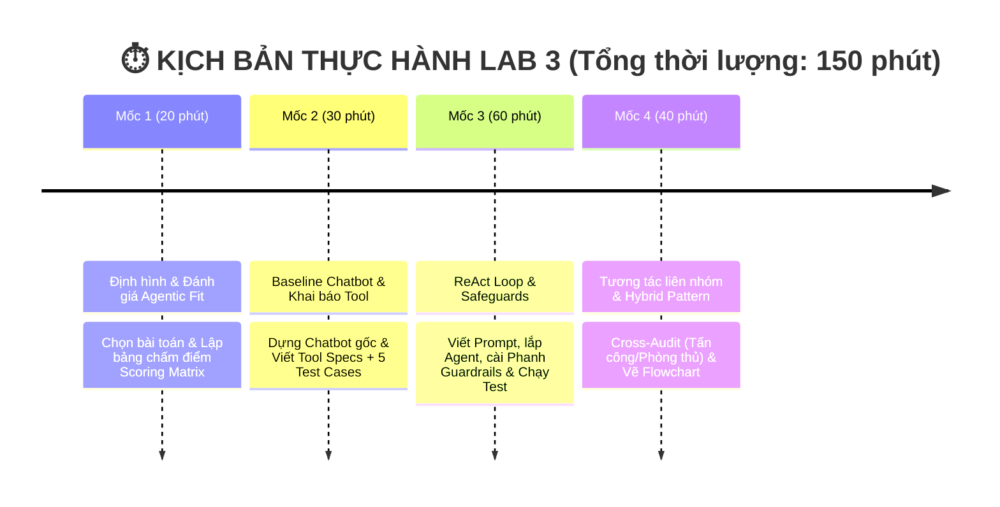

# 🏫 BÀI LAB 3: CHATBOT VS REACT AGENT - TỪ Ý TƯỞNG ĐẾN THỰC THI

---

### 💡 1. LỜI NÓI ĐẦU & NỀN TẢNG LÝ THUYẾT (4 CẤP ĐỘ AI HỘI THOẠI)

Bài Lab giúp bạn hiểu rõ sự tiến hóa qua 4 cấp độ của hệ thống AI:

| Cấp độ | Loại hệ thống | Đặc điểm chính | Sự xuất hiện trong Bài Lab |
| :---: | :--- | :--- | :--- |
| **Cấp 1** | **Rule-Based Bot** | Khớp từ khóa if/else cố định, không có LLM | *Minh họa lịch sử* |
| **Cấp 2** | **LLM Chatbot** | Dùng LLM sinh text mượt, nhưng không gọi được Tool | **Chatbot Baseline** (Phần thực hành 1) |
| **Cấp 3** | **Reactive Agent** | Suy luận `Thought -> Action -> Observation` & gọi Tool | **ReAct Agent Loop** (Trọng tâm Bài Lab) |
| **Cấp 4** | **Autonomous Agent** | Tự rã mục tiêu (Planning), tự đánh giá & có Memory | 🎁 **Phần Bonus Nâng cao (+10%)** |

* 🤖 **Chatbot thông thường (Cấp 2)**: Giống như một **chuyên gia lý thuyết** — chỉ trả lời dựa trên kiến thức tĩnh có sẵn trong LLM, không thể tra cứu số liệu thực tế hay tự thực hiện thao tác.
* 🧠 **ReAct Agent (Cấp 3)**: Giống như một **trợ lý thực hành** — vừa biết suy nghĩ (**Thought**), vừa biết chủ động dùng công cụ (**Action**) như phần mềm tra cứu/tính toán, và quan sát kết quả (**Observation**) để giải quyết các bài toán thực tế.

---

### 📂 2. CẤU TRÚC THƯ MỤC DỰ ÁN

```text
📁 Day-3-Lab-Chatbot-vs-react-agent-E402/
├── 📄 README.md                 <-- 📘 Tổng quan bài Lab & Thang điểm
├── 📄 .env.example              <-- 🔑 File mẫu API Key
├── 📄 requirements.txt          <-- 📦 Thư viện cần cài đặt
│
├── 📁 config/                   <-- 🛠️ CẤU HÌNH & DỮ LIỆU
│   └── 📄 test_cases.json       <-- 🟢 [Role 1] Bộ đề 5 Test Cases thử thách AI
│
├── 📁 src/                      <-- 💻 MÃ NGUỒN PYTHON (BOILERPLATE)
│   ├── 📄 tools.py              <-- 🛠️ [Role 2] Khai báo các công cụ (Tools)
│   ├── 📄 prompts.py            <-- 🧠 [Role 3] ReAct System Prompt & Guardrails
│   └── 📄 app.py                <-- 🚀 [Role 4] Core App ghép nối & chạy ReAct Loop
│
└── 📁 docs/                     <-- 📚 TÀI LIỆU HƯỚNG DẪN & BÁO CÁO
    ├── 📄 CODELAB.md            <-- 🎓 [LMS Format] Hướng dẫn thực hành từng bước Codelab
    ├── 📄 PHAN_CONG_CONG_VIEC.md <-- 📋 [BẮT ĐẦU TẠI ĐÂY] Sổ tay thực hành & Checklist 5 Roles
    ├── 📄 DANH_SACH_DE_TAI.md    <-- 💡 Danh sách 10 chủ đề gợi ý
    └── 📄 trace_eval.md          <-- 📊 [Role 5] Báo cáo Log Trace & Đánh giá Agentic Fit
```

---

### ⏱️ 3. LỘ TRÌNH THỰC HÀNH (4 MỐC / 150 PHÚT)



---

### 💯 4. CƠ CHẾ CHẤM ĐIỂM  (SCORING RUBRIC)

| Tiêu chí                                |  Trọng số  | Mô tả chi tiết                                                                                                             | Bằng chứng kiểm tra (Artifacts)                                        |
| :---------------------------------------- | :-----------: | :---------------------------------------------------------------------------------------------------------------------------- | :------------------------------------------------------------------------ |
| **1. Agentic Fit & Test Design**    | **20%** | Phân tích đúng 4 tiêu chí Agentic Fit cho chủ đề tự chọn. Bộ test cases đủ góc cạnh (đơn giản, multi-step, edge cases). | Bảng chấm điểm (`docs/trace_eval.md`) + `config/test_cases.json`. |
| **2. ReAct Implementation & Tools** | **30%** | Tool description rõ ràng. Vòng lặp ReAct chạy đúng chuẩn `Thought -> Action -> Observation`.                         | Code trong `src/tools.py` + `src/app.py`.                              |
| **3. Guardrails & Observability**   | **20%** | Bắt được lỗi loop, có max iterations (Guardrail). Trích xuất được ít nhất 1 Trace log hoàn chỉnh.                     | File `src/prompts.py` + Log trong `docs/trace_eval.md`.                |
| **4. Inter-group Attack & Defense** | **20%** | Phản biện tốt khi gọi ngẫu nhiên hoặc cử 1 bạn đi chấm chéo (+10đ). Agent chống đỡ tốt / fallback chuẩn (+10đ).        | Biên bản Cross-Audit / Trả lời phản biện.                             |
| **5. Hybrid Decision Flowchart**    | **10%** | Sơ đồ thể hiện rõ khi nào đi Chatbot path, khi nào đi ReAct Agent path.                                             | Sơ đồ Flowchart (`docs/hybrid_flowchart.mermaid`).                   |
| 🎁 **BONUS: Autonomous Agent**     | **+10%**| Thử nghiệm tính năng Planning (tự chia nhỏ mục tiêu) hoặc Memory cho Agent (Cấp 4).                                  | Demo code trong `src/app.py` hoặc giải trình trong report.           |

---

> 🚀 **BẮT ĐẦU LÀM BÀI**:
> Vui lòng mở sổ tay thực hành 👉 **[PHAN_CONG_CONG_VIEC.md](file:///c:/Users/Admin/Documents/VinUni/LabCoachVin/LabKeyCoach/Day-3-Lab-Chatbot-vs-react-agent-E402/docs/PHAN_CONG_CONG_VIEC.md)** để xem phân vai và checklist công việc cụ thể cho từng thành viên!

---

### 🖥️ 5. GIAO DIỆN ỨNG DỤNG (UI DESIGN)

Giao diện được xây dựng bằng **Streamlit** (`app_ui.py`), ánh xạ từng phần theo các tiêu chí chấm điểm.

#### 5.1. Backend API Contract

Backend (`src/app.py`) phải trả về **structured JSON** cho frontend:

```json
// Chatbot Response
{ "mode": "chatbot", "query": "...", "response": "..." }

// Agent Response  
{
  "mode": "agent",
  "query": "...",
  "steps": [
    {
      "step": 1,
      "thought": "Cần phân tích INFP trước",
      "action": "analyze_personality",
      "action_input": "INFP",
      "observation": "INFP - Lý tưởng hóa, sáng tạo..."
    }
  ],
  "final_answer": "Nên tặng sổ tay bìa da 250k...",
  "guardrail_triggered": false,
  "total_steps": 2
}
```

#### 5.2. Layout giao diện

```
┌─────────────────────────────────────────────────┐
│  🏫 VINUNI LAB 3 - CHATBOT VS REACT AGENT       │
│  Chủ đề: Trợ Lý Chọn Quà Tặng                    │
├─────────────────────────────────────────────────┤
│                                                   │
│  ┌─────────── INPUT ──────────────────────────┐  │
│  │ Dropdown: [Test Case #4 ▼]                  │  │
│  │ ➜ Bạn thân tôi là INFP, 300k, tặng gì?     │  │
│  │ ┌─────────────────────────────────┐         │  │
│  │ │ Hoặc nhập câu hỏi tay...         │         │  │
│  │ └─────────────────────────────────┘         │  │
│  │ [🧠 Run Chatbot] [🤖 Run Agent] [⚖️ Compare] │  │
│  │ [▶️ Run All 5 Tests]                        │  │
│  └─────────────────────────────────────────────┘  │
│                                                   │
│  ┌─────────── RESULTS ─────────────────────────┐  │
│  │  ┌─── Chatbot ───┐ ┌─── ReAct Trace ──────┐ │  │
│  │  │ INFP là người  │ │ Step 1/3              │ │  │
│  │  │ lý tưởng hóa,  │ │ 🧠 Thought: Cần...    │ │  │
│  │  │ sáng tạo...    │ │ 🔧 Action: analyze... │ │  │
│  │  │                │ │ 📊 Obs: INFP - Lý...  │ │  │
│  │  │ ❌ Ảo giác     │ │                       │ │  │
│  │  │ (không có giá  │ │ Step 2/3              │ │  │
│  │  │ thực tế)       │ │ 🧠 Thought: Đã có...  │ │  │
│  │  └────────────────┘ │ 🔧 Action: suggest... │ │  │
│  │                     │ 📊 Obs: Sổ tay 250k   │ │  │
│  │                     │                       │ │  │
│  │                     │ 🏁 Final Answer: ...   │ │  │
│  │                     │ 🛡️ Guardrail: False   │ │  │
│  │                     │ ─────────────────────  │ │  │
│  │                     │ [📋 Copy Trace Log]    │ │  │
│  │                     └────────────────────────┘ │
│  └─────────────────────────────────────────────┘  │
│                                                   │
│  ┌─────────── COMPARISON TABLE ────────────────┐  │
│  │ ID │ Question    │ Chatbot    │ Agent        │  │
│  │ 1  │ INFP là gì? │ ✅ Đúng    │ ✅ Đúng      │  │
│  │ 3  │ Sách+500k   │ ❌ Ảo giác │ ✅ Evidence  │  │
│  │ 5  │ XQZ-999     │ ❌ Ảo giác │ 🟡 Fallback   │  │
│  └─────────────────────────────────────────────┘  │
│                                                   │
│  ┌─────────── SCORING MATRIX ──────────────────┐  │
│  │ Multi-step: 4/5 │ Tool: 5/5 │ Dynamic: 4/5 │  │
│  │ Long Horizon: 3/5 │ TOTAL: 16/20            │  │
│  │ ✅ KẾT LUẬN: NÊN DÙNG REACT AGENT           │  │
│  └─────────────────────────────────────────────┘  │
│                                                   │
│  ┌─────────── TOOL REGISTRY ───────────────────┐  │
│  │ analyze_personality(type) → str             │  │
│  │ suggest_gifts(interests, budget, occ) → str │  │
│  └─────────────────────────────────────────────┘  │
└─────────────────────────────────────────────────┘
```

#### 5.3. Component mapping với tiêu chí chấm điểm

| Khu vực UI | Component | Tiêu chí |
|:---|:---|:---:|
| **Input** | Dropdown test case (load từ `config/test_cases.json`) | #1 - Test Design |
| **Input** | Ô nhập tay (cho cross-audit) | #4 - Attack & Defense |
| **Chatbot** | Hiển thị response + label "Không tool" | #2 - Baseline |
| **ReAct Trace** | Step counter (1/3) + Thought + Action + Observation | #2 - ReAct Loop |
| **ReAct Trace** | Guardrail warning (đỏ) khi quá MAX_ITERATIONS | #3 - Guardrails |
| **ReAct Trace** | Nút Copy Trace Log để dán vào `docs/trace_eval.md` | #3 - Observability |
| **Comparison** | Bảng so sánh Chatbot vs Agent (✅/❌/🟡) | #5 - Hybrid |
| **Scoring Matrix** | 4 tiêu chí điểm 1-5 + tổng /20 + kết luận | #1 - Agentic Fit |
| **Tool Registry** | Danh sách tool + input/output/error | #2 - Tools |
| **Run All** | Chạy batch 5 test cases, xuất bảng tổng hợp | #5 - Evaluation |

#### 5.4. Flow dữ liệu

```
User click button
  ↓
app_ui.py (Streamlit)
  ↓
Gọi hàm từ src/app.py:
  - run_baseline_chatbot(query, provider) → response text
  - run_react_agent(query, provider) → JSON {steps[], final_answer, guardrail}
  ↓
Frontend render từng step:
  - Step 1: 🧠 Thought → 🔧 Action → 📊 Observation
  - Step 2: ... 
  - 🏁 Final Answer
  - 🛡️ Guardrail status
```

#### 5.5. File cần tạo/sửa

| File | Hành động | Nội dung |
|:---|:---|:---|
| `app_ui.py` | **Tạo mới** | Giao diện Streamlit, gọi backend, render kết quả |
| `src/app.py` | **Sửa** | Refactor `run_react_agent()` thành vòng lặp LLM thật, parse Action, gọi tool động, trả JSON |
| `src/tools.py` | **Sửa** | Đổi tool sang chủ đề #3: `analyze_personality`, `suggest_gifts` |
| `src/prompts.py` | **Sửa** | Cập nhật tool list trong `REACT_SYSTEM_PROMPT` |
| `requirements.txt` | **Sửa** | Thêm `streamlit` |
| `docs/hybrid_flowchart.mermaid` | **Tạo mới** | Sơ đồ đường đi Chatbot vs Agent |

#### 5.6. Ghi chú quan trọng

> **Backend phải chạy vòng lặp ReAct thật trước khi giao diện hoạt động đúng.**
> 
> Frontend có thể dùng **mock data** để dựng giao diện trước, chờ backend xong thì gắn API thật vào.
