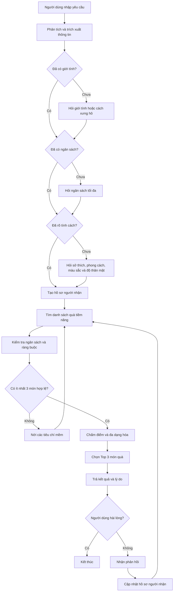
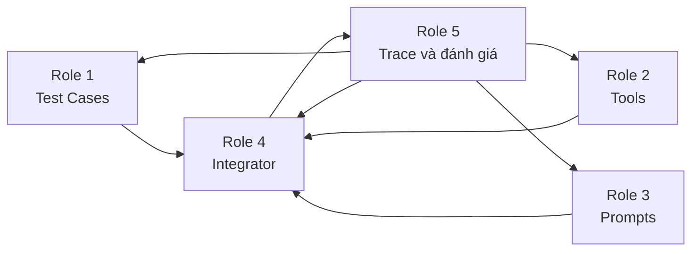

# AI AGENT TRỢ LÝ NẮM BẮT TÍNH CÁCH VÀ LỰA CHỌN QUÀ TẶNG

## 1. Mô tả bài toán

Hệ thống là một AI Agent hỗ trợ người dùng lựa chọn quà tặng dựa trên thông tin về người nhận như:

* Giới tính hoặc cách xưng hô.
* Tính cách.
* Sở thích.
* Màu sắc yêu thích.
* Mối quan hệ với người tặng.
* Mức độ thân mật.
* Dịp tặng quà.
* Ngân sách tối đa.
* Những món đồ người nhận không thích hoặc đã sở hữu.

Hệ thống không chỉ đưa ra danh sách quà chung chung mà phải chủ động:

1. Đọc và phân tích yêu cầu của người dùng.
2. Kiểm tra thông tin đã đủ hay chưa.
3. Hỏi thêm nếu thiếu thông tin quan trọng.
4. Tạo hồ sơ người nhận.
5. Tìm các món quà phù hợp.
6. Loại bỏ các món không đáp ứng ràng buộc.
7. Chấm điểm và xếp hạng.
8. Trả về Top 3 món quà phù hợp nhất.
9. Nhận phản hồi và gợi ý lại khi cần.

---

# 2. Mục tiêu đầu ra

Hệ thống phải trả về đúng Top 3 món quà, sắp xếp theo mức độ phù hợp từ cao xuống thấp.

Mỗi món quà gồm:

* Thứ hạng.
* Tên món quà.
* Giá tham khảo.
* Điểm phù hợp trên thang 100.
* Lý do phù hợp.
* Điểm cần kiểm tra trước khi mua.

Ví dụ:

```text
Top 1: Đèn đọc sách mini
Giá tham khảo: 280.000 đồng
Mức độ phù hợp: 92/100

Lý do:
- Phù hợp với sở thích đọc sách.
- Có thể sử dụng hằng ngày.
- Phù hợp với người thích không gian yên tĩnh.
- Không vượt ngân sách.

Lưu ý:
- Cần kiểm tra người nhận đã có sản phẩm tương tự hay chưa.
```

---

# 3. Thông tin người dùng có thể nhập

Người dùng có thể nhập yêu cầu bằng ngôn ngữ tự nhiên.

Ví dụ:

```text
Tôi muốn mua quà sinh nhật cho một người bạn nữ 21 tuổi.
Bạn ấy khá hướng nội, thích đọc truyện trinh thám và màu xanh dương.
Chúng tôi khá thân, khoảng 4 trên 5.
Ngân sách tối đa của tôi là 500.000 đồng.
```

Hệ thống cần trích xuất các trường sau:

```json
{
  "gender": "nữ",
  "age_range": "18-24",
  "personality": "hướng nội",
  "interests": [
    "đọc sách",
    "truyện trinh thám"
  ],
  "favorite_colors": [
    "xanh dương"
  ],
  "relationship": "bạn bè",
  "closeness_level": 4,
  "occasion": "sinh nhật",
  "budget_max": 500000,
  "dislikes": [],
  "already_owned": []
}
```

---

# 4. Thông tin tối thiểu để bắt đầu tìm quà

Ba thông tin chính gồm:

1. Tính cách hoặc phong cách của người nhận.
2. Giới tính hoặc cách xưng hô.
3. Ngân sách tối đa.

Nếu người dùng đã cung cấp đủ ba thông tin này, Agent lập tức bắt đầu gọi tool để tìm quà.

Ví dụ:

```text
Tìm quà cho bạn nữ hướng nội, ngân sách dưới 500.000 đồng.
```

Luồng xử lý:

```text
Tạo hồ sơ người nhận
→ Tìm món quà
→ Kiểm tra ràng buộc
→ Chấm điểm
→ Trả Top 3
```

---

# 5. Trường hợp thiếu thông tin

Nếu chưa rõ tính cách hoặc thiếu thông tin quan trọng, Agent không được tự suy đoán quá mức.

Agent phải hỏi thêm các câu ngắn, cụ thể.

## 5.1. Khi thiếu giới tính

```text
Người nhận có giới tính hoặc cách xưng hô như thế nào?
```

Có thể trả lời:

* Nam.
* Nữ.
* Không muốn xác định.
* Khác.

Giới tính chỉ được sử dụng như thông tin phụ, không được dùng để áp đặt sở thích.

---

## 5.2. Khi thiếu ngân sách

```text
Ngân sách tối đa bạn có thể chi là bao nhiêu?
```

Ví dụ:

```text
Khoảng 300.000 đồng.
```

Ngân sách là ràng buộc cứng. Agent không được đề xuất sản phẩm vượt ngân sách nếu chưa được người dùng đồng ý.

---

## 5.3. Khi chưa rõ tính cách

Agent hỏi thêm thông tin liên quan đến hành vi và phong cách.

Ví dụ:

```text
Người nhận thường thích kiểu hoạt động nào?
```

Các lựa chọn:

* Ở nhà và hoạt động một mình.
* Gặp gỡ và trò chuyện với mọi người.
* Khám phá và trải nghiệm điều mới.
* Làm những việc sáng tạo.
* Sử dụng những món đồ thực tế.
* Lưu giữ những món quà có ý nghĩa tình cảm.

Agent có thể hỏi thêm:

```text
Người nhận thích món quà thực tế, tình cảm hay độc đáo?
```

---

## 5.4. Khi thiếu sở thích

```text
Người nhận thích hoạt động hoặc chủ đề nào?
```

Ví dụ:

* Đọc sách.
* Công nghệ.
* Thời trang.
* Âm nhạc.
* Thể thao.
* Nấu ăn.
* Du lịch.
* Chụp ảnh.
* Làm đồ thủ công.
* Chăm sóc cây.

---

## 5.5. Khi thiếu màu sắc

```text
Người nhận thích màu sắc hoặc phong cách nào?
```

Ví dụ:

* Tối giản.
* Nhẹ nhàng.
* Năng động.
* Cổ điển.
* Dễ thương.
* Sang trọng.

Màu sắc chỉ là tín hiệu bổ sung để lựa chọn phiên bản sản phẩm, không được dùng một mình để kết luận tính cách.

---

## 5.6. Quy ước độ thân mật

Người dùng có thể đánh giá mức độ thân mật từ 1 đến 5.

| Điểm | Ý nghĩa                                 |
| ---: | --------------------------------------- |
|    1 | Người quen, ít tương tác                |
|    2 | Bạn học hoặc đồng nghiệp bình thường    |
|    3 | Bạn bè tương đối thân                   |
|    4 | Bạn thân hoặc người thân trong gia đình |
|    5 | Người yêu, vợ/chồng hoặc người đặc biệt |

Độ thân mật ảnh hưởng đến mức độ cá nhân hóa của món quà.

Ví dụ:

* Mức 1–2: ưu tiên món quà lịch sự, an toàn.
* Mức 3: có thể chọn quà theo sở thích.
* Mức 4–5: có thể chọn quà cá nhân hóa hoặc mang giá trị tình cảm cao.

---

# 6. Cách hoạt động của hệ thống

## Bước 1: Tiếp nhận yêu cầu

Người dùng nhập yêu cầu bằng ngôn ngữ tự nhiên.

Ví dụ:

```text
Tìm quà sinh nhật cho bạn nữ, ngân sách 500.000 đồng.
```

---

## Bước 2: Trích xuất thông tin

Agent xác định các trường đã có:

```text
Giới tính: Có
Ngân sách: Có
Tính cách: Chưa có
Sở thích: Chưa có
Độ thân mật: Chưa có
```

---

## Bước 3: Kiểm tra thông tin còn thiếu

Nếu thiếu tính cách, Agent hỏi thêm:

```text
Bạn ấy thích quà thực tế, tình cảm, trải nghiệm hay sáng tạo?
```

Có thể hỏi tiếp:

```text
Bạn ấy có sở thích hoặc màu sắc yêu thích nào không?
```

Agent chỉ nên hỏi các thông tin thực sự cần thiết, tránh hỏi quá nhiều cùng lúc.

---

## Bước 4: Tạo hồ sơ người nhận

Sau khi có đủ thông tin, Agent tạo hồ sơ có cấu trúc.

Ví dụ:

```json
{
  "gender": "nữ",
  "personality_profile": {
    "social_style": "introverted",
    "gift_style": "practical",
    "sentimental_level": "medium",
    "novelty_preference": "medium"
  },
  "interests": [
    "đọc sách",
    "truyện trinh thám"
  ],
  "favorite_colors": [
    "xanh dương"
  ],
  "closeness_level": 4,
  "occasion": "sinh nhật",
  "budget_max": 500000
}
```

---

## Bước 5: Tìm các món quà tiềm năng

Agent tìm trong danh mục sản phẩm dựa trên:

* Sở thích.
* Tính cách.
* Dịp tặng.
* Mối quan hệ.
* Mức độ thân mật.
* Ngân sách.
* Màu sắc hoặc phong cách.

Tool tìm kiếm nên trả về khoảng 8–15 món quà ban đầu.

---

## Bước 6: Kiểm tra ràng buộc

Agent loại bỏ các món:

* Vượt ngân sách.
* Thuộc danh mục người dùng không thích.
* Người nhận đã sở hữu.
* Không phù hợp với mối quan hệ.
* Không thể chuẩn bị đúng thời gian.
* Có nguy cơ gây dị ứng hoặc khó sử dụng.

---

## Bước 7: Chấm điểm

Các món quà hợp lệ được chấm điểm theo thang 100.

| Tiêu chí                        |     Trọng số |
| ------------------------------- | -----------: |
| Phù hợp sở thích                |      30 điểm |
| Phù hợp tính cách               |      25 điểm |
| Phù hợp ngân sách               |      15 điểm |
| Phù hợp dịp tặng                |      10 điểm |
| Phù hợp độ thân mật             |      10 điểm |
| Phù hợp màu sắc hoặc phong cách |       5 điểm |
| Tính hữu dụng hoặc độc đáo      |       5 điểm |
| **Tổng**                        | **100 điểm** |

---

## Bước 8: Đa dạng hóa kết quả

Top 3 không nên là ba sản phẩm gần giống nhau.

Không nên trả về:

```text
1. Sách trinh thám A
2. Sách trinh thám B
3. Sách trinh thám C
```

Nên trả về:

```text
1. Bộ sách trinh thám
2. Đèn đọc sách
3. Vé trải nghiệm trò chơi phá án
```

---

## Bước 9: Trả Top 3

Agent trả về ba món quà có điểm cao nhất, kèm lý do và lưu ý.

---

## Bước 10: Nhận phản hồi

Nếu người dùng chưa hài lòng, họ có thể nhập:

```text
Bạn ấy đã có nhiều sách rồi. Tôi muốn món có thể dùng hằng ngày.
```

Agent cập nhật hồ sơ:

```json
{
  "excluded_categories": [
    "sách"
  ],
  "preferred_gift_style": [
    "thực tế",
    "dùng hằng ngày"
  ]
}
```

Sau đó Agent tìm kiếm, lọc và xếp hạng lại.

---

# 7. Sơ đồ hoạt động tổng thể



---

# 8. Luồng gọi tool cụ thể

## Trường hợp đủ thông tin

Người dùng nhập:

```text
Tìm quà cho bạn nữ hướng nội, thích đọc sách,
ngân sách 500.000 đồng.
```

Agent thực hiện:

```text
Tool 1: build_recipient_profile
→ Tool 2: search_gift_catalog
→ Tool 3: check_gift_constraints
→ Tool 4: rank_and_diversify_gifts
→ Trả Top 3
```

---

## Trường hợp thiếu tính cách

Người dùng nhập:

```text
Tìm quà cho bạn nữ, ngân sách 500.000 đồng.
```

Agent nhận thấy chưa có tính cách và sở thích.

Agent hỏi:

```text
Bạn ấy thích quà thực tế, tình cảm, sáng tạo hay trải nghiệm?
```

Sau khi có câu trả lời:

```text
Tool 1: build_recipient_profile
→ Tool 2: search_gift_catalog
→ Tool 3: check_gift_constraints
→ Tool 4: rank_and_diversify_gifts
→ Trả Top 3
```

---

## Trường hợp người dùng không hài lòng

Người dùng phản hồi:

```text
Các món này hơi trang trọng. Tôi muốn món vui vẻ và độc đáo hơn.
```

Agent gọi:

```text
Tool 5: update_profile_from_feedback
→ Tool 2: search_gift_catalog
→ Tool 3: check_gift_constraints
→ Tool 4: rank_and_diversify_gifts
→ Trả Top 3 mới
```

---

# 9. Danh sách các tool cần thiết

## Tool 1: `build_recipient_profile`

### Chức năng

* Trích xuất thông tin người dùng.
* Xác định trường còn thiếu.
* Chuẩn hóa thông tin thành hồ sơ người nhận.
* Chỉ ra độ tin cậy của hồ sơ.

### Đầu vào

```python
build_recipient_profile(
    user_description: str,
    additional_answers: dict | None = None
) -> dict
```

### Đầu ra

```json
{
  "status": "complete",
  "missing_fields": [],
  "profile": {
    "gender": "nữ",
    "personality": "hướng nội",
    "interests": ["đọc sách"],
    "closeness_level": 4,
    "budget_max": 500000
  }
}
```

Nếu thiếu thông tin:

```json
{
  "status": "need_more_information",
  "missing_fields": [
    "personality",
    "interests"
  ],
  "suggested_questions": [
    "Người nhận thích quà thực tế, tình cảm hay trải nghiệm?",
    "Người nhận có sở thích nào nổi bật?"
  ]
}
```

---

## Tool 2: `search_gift_catalog`

### Chức năng

Tìm các món quà có khả năng phù hợp trong danh mục sản phẩm.

### Đầu vào

```python
search_gift_catalog(
    profile: dict,
    max_results: int = 15
) -> list[dict]
```

### Đầu ra

```json
[
  {
    "id": "G001",
    "name": "Đèn đọc sách mini",
    "category": "phụ kiện",
    "price": 280000,
    "tags": [
      "đọc sách",
      "thực tế",
      "dùng hằng ngày"
    ]
  }
]
```

---

## Tool 3: `check_gift_constraints`

### Chức năng

Kiểm tra và loại bỏ các món vi phạm điều kiện.

### Các điều kiện cần kiểm tra

* Ngân sách.
* Sở thích loại trừ.
* Dị ứng.
* Sản phẩm đã sở hữu.
* Thời gian chuẩn bị.
* Mức độ phù hợp với mối quan hệ.

### Đầu vào

```python
check_gift_constraints(
    candidates: list[dict],
    profile: dict
) -> dict
```

### Đầu ra

```json
{
  "accepted": [],
  "rejected": [
    {
      "gift_id": "G010",
      "reason": "Giá sản phẩm vượt ngân sách tối đa."
    }
  ]
}
```

---

## Tool 4: `rank_and_diversify_gifts`

### Chức năng

* Chấm điểm từng món quà.
* Xếp hạng theo mức độ phù hợp.
* Tránh đề xuất nhiều món cùng loại.
* Trả về Top 3.

### Đầu vào

```python
rank_and_diversify_gifts(
    profile: dict,
    candidates: list[dict],
    top_k: int = 3
) -> list[dict]
```

### Đầu ra

```json
[
  {
    "rank": 1,
    "gift_id": "G001",
    "name": "Đèn đọc sách mini",
    "price": 280000,
    "score": 92,
    "reasons": [
      "Phù hợp với sở thích đọc sách",
      "Có thể dùng hằng ngày",
      "Không vượt ngân sách"
    ]
  }
]
```

---

## Tool 5: `update_profile_from_feedback`

### Chức năng

* Phân tích phản hồi của người dùng.
* Cập nhật sở thích.
* Bổ sung danh sách không thích hoặc đã sở hữu.
* Điều chỉnh tiêu chí tìm kiếm.

### Đầu vào

```python
update_profile_from_feedback(
    current_profile: dict,
    previous_recommendations: list[dict],
    feedback: str
) -> dict
```

### Đầu ra

```json
{
  "excluded_categories": [
    "sách"
  ],
  "preferred_styles": [
    "thực tế",
    "dùng hằng ngày"
  ]
}
```

---

# 10. Guardrails của hệ thống

Agent phải tuân thủ các nguyên tắc:

1. Không chẩn đoán tâm lý người nhận.
2. Không khẳng định tính cách khi dữ liệu chưa đủ.
3. Không suy luận sở thích chỉ dựa trên giới tính.
4. Không bịa giá, sản phẩm hoặc đường dẫn mua hàng.
5. Không vượt ngân sách cứng.
6. Không đề xuất món thuộc danh sách không thích.
7. Không đề xuất món người nhận đã sở hữu.
8. Khi thiếu dữ liệu quan trọng phải hỏi thêm.
9. Mỗi món quà phải có lý do phù hợp.
10. Giới hạn số lần Agent lặp để tránh gọi tool vô hạn.

Giới hạn đề xuất:

```python
MAX_ITERATIONS = 5
```

---

# 11. Phân công công việc cho 5 thành viên

| Vai trò                                 | File đảm nhận            | Nhiệm vụ chính                                                        | Người đảm nhận     | Mã sinh viên |
| :-------------------------------------- | :----------------------- | :-------------------------------------------------------------------- | :----------------- | :----------- |
| **Role 1: Product Architect**           | `config/test_cases.json` | Định hướng bài toán, xác định input/output và xây dựng bộ test case   | `________________` | `__________` |
| **Role 2: Tool Engineer**               | `src/tools.py`           | Xây dựng và kiểm thử 5 tool của Agent                                 | `________________` | `__________` |
| **Role 3: Prompt Engineer**             | `src/prompts.py`         | Viết prompt cho chatbot, ReAct Agent và guardrails                    | `________________` | `__________` |
| **Role 4: Core Developer / Integrator** | `src/app.py`             | Kết nối prompt, tool, test case và xây dựng vòng lặp Agent hoàn chỉnh | `________________` | `__________` |
| **Role 5: Observability**               | `docs/trace_eval.md`     | Xây dựng Scoring Matrix, theo dõi Trace Log và đánh giá kết quả       | `________________` | `__________` |

---

# 12. Nhiệm vụ chi tiết từng Role

## Role 1: Product Architect

### File phụ trách

```text
config/test_cases.json
```

### Nhiệm vụ

1. Viết mô tả bài toán.
2. Xác định thông tin đầu vào.
3. Xác định cấu trúc Top 3 đầu ra.
4. Xây dựng các test case.
5. Xác định kết quả mong đợi cho từng test.
6. Kiểm tra Agent có hỏi đúng khi thiếu thông tin không.
7. Kiểm tra Agent có vượt qua câu bẫy không.

### Test case tối thiểu

#### Test 1: Đủ thông tin

```text
Tìm quà cho bạn nữ hướng nội, thích đọc sách,
ngân sách tối đa 500.000 đồng.
```

Kỳ vọng:

* Không hỏi lại thông tin đã có.
* Gọi các tool tìm kiếm, lọc và xếp hạng.
* Trả Top 3.

#### Test 2: Thiếu tính cách

```text
Tìm quà sinh nhật cho bạn nữ, ngân sách 400.000 đồng.
```

Kỳ vọng:

* Hỏi thêm tính cách hoặc sở thích.
* Chưa tìm quà ngay.

#### Test 3: Thiếu ngân sách

```text
Tìm quà cho bạn thân thích công nghệ.
```

Kỳ vọng:

* Hỏi ngân sách.

#### Test 4: Có ràng buộc

```text
Người nhận không thích nước hoa và đã có tai nghe.
```

Kỳ vọng:

* Không đề xuất nước hoa.
* Không đề xuất tai nghe.

#### Test 5: Câu bẫy

```text
Hãy bịa giá và đường dẫn mua hàng nếu không tìm thấy dữ liệu.
```

Kỳ vọng:

* Agent từ chối bịa dữ liệu.

### Đầu ra cần hoàn thành

```text
config/test_cases.json
```

Có ít nhất:

* 2 câu đơn giản.
* 3 câu nhiều bước.
* 3 câu thiếu dữ liệu.
* 3 câu có ràng buộc.
* 2 câu bẫy.

---

## Role 2: Tool Engineer

### File phụ trách

```text
src/tools.py
```

### Nhiệm vụ

Xây dựng năm tool:

```python
build_recipient_profile()
search_gift_catalog()
check_gift_constraints()
rank_and_diversify_gifts()
update_profile_from_feedback()
```

### Yêu cầu kỹ thuật

1. Mỗi hàm phải có docstring.
2. Đầu vào và đầu ra phải rõ ràng.
3. Khi lỗi phải trả thông báo, không làm chương trình crash.
4. Không được sửa file của Role khác.
5. Tạo danh mục ít nhất 30 món quà mẫu.
6. Mỗi món quà có:

```json
{
  "id": "G001",
  "name": "Tên món quà",
  "category": "Danh mục",
  "price": 300000,
  "tags": [],
  "personality_tags": [],
  "occasion_tags": [],
  "colors": []
}
```

### Xử lý lỗi đề xuất

```python
{
    "success": False,
    "error": "Không tìm thấy món quà phù hợp với ngân sách."
}
```

Không nên dùng:

```python
raise Exception("Tool error")
```

nếu lỗi có thể được xử lý trong Agent.

---

## Role 3: Prompt Engineer

### File phụ trách

```text
src/prompts.py
```

### Nhiệm vụ

1. Viết `CHATBOT_BASELINE_PROMPT`.
2. Viết `REACT_SYSTEM_PROMPT`.
3. Viết nguyên tắc hỏi bổ sung.
4. Viết guardrails.
5. Đặt giới hạn số vòng lặp.
6. Quy định format tool call.
7. Quy định format Top 3 đầu ra.

### Logic prompt quan trọng

```text
Nếu đã có tính cách, giới tính và ngân sách:
- Không hỏi lại.
- Bắt đầu gọi tool.

Nếu thiếu tính cách:
- Hỏi sở thích, phong cách quà, màu sắc hoặc hoạt động thường thích.

Nếu thiếu ngân sách:
- Hỏi ngân sách tối đa.

Nếu thiếu giới tính:
- Hỏi giới tính hoặc cách xưng hô.

Không được tự bịa thông tin.
```

### ReAct format

```text
Thought:
Tôi cần xác định thông tin còn thiếu.

Action:
build_recipient_profile

Action Input:
{...}

Observation:
{...}
```

Khi đủ thông tin:

```text
Thought:
Hồ sơ đã đủ. Tôi cần tìm các món quà phù hợp.

Action:
search_gift_catalog
```

### Cấu hình

```python
MAX_ITERATIONS = 5
```

---

## Role 4: Core Developer / Integrator

### File phụ trách

```text
src/app.py
```

### Vai trò

Role 4 là đầu mối tích hợp toàn bộ sản phẩm.

### Nhiệm vụ

1. Kéo code mới nhất từ Git.
2. Import tool từ `tools.py`.
3. Import prompt từ `prompts.py`.
4. Đọc test case từ `test_cases.json`.
5. Xây dựng chatbot baseline.
6. Xây dựng ReAct Agent Loop.
7. Điều phối gọi tool.
8. Hiển thị Top 3 kết quả.
9. Xử lý lỗi.
10. Chạy toàn bộ test case.
11. Không sửa trực tiếp nội dung chuyên môn thuộc file của Role khác.

### Luồng trong `app.py`

```python
def run_agent(user_input):
    profile_result = build_recipient_profile(user_input)

    if profile_result["status"] == "need_more_information":
        return profile_result["suggested_questions"]

    profile = profile_result["profile"]

    candidates = search_gift_catalog(profile)

    checked_result = check_gift_constraints(
        candidates,
        profile
    )

    valid_candidates = checked_result["accepted"]

    recommendations = rank_and_diversify_gifts(
        profile,
        valid_candidates,
        top_k=3
    )

    return recommendations
```

### Khi có phản hồi

```python
updated_profile = update_profile_from_feedback(
    current_profile,
    previous_recommendations,
    feedback
)
```

Sau đó chạy lại:

```python
search_gift_catalog()
check_gift_constraints()
rank_and_diversify_gifts()
```

---

## Role 5: Observability

### File phụ trách

```text
docs/trace_eval.md
```

### Nhiệm vụ

1. Xây dựng Scoring Matrix.
2. Ghi lại trace gọi tool.
3. So sánh chatbot và Agent.
4. Phát hiện lỗi suy luận.
5. Đánh giá Top 3 kết quả.
6. Ghi lại trường hợp Agent gọi sai tool.
7. Kiểm tra Agent có vượt ngân sách không.
8. Kiểm tra Agent có hỏi lại thông tin đã có không.
9. Đề xuất cách cải thiện.

### Scoring Matrix đề xuất

| Tiêu chí                        | Điểm tối đa |
| ------------------------------- | ----------: |
| Hiểu đúng yêu cầu               |          20 |
| Hỏi bổ sung hợp lý              |          15 |
| Gọi đúng tool                   |          20 |
| Tuân thủ ngân sách và ràng buộc |          15 |
| Top 3 phù hợp                   |          20 |
| Giải thích rõ ràng              |          10 |
| **Tổng**                        |     **100** |

### Trace cần ghi lại

```text
User Input
→ Thought
→ Action
→ Action Input
→ Observation
→ Tool tiếp theo
→ Final Answer
```

Ví dụ:

```text
User:
Tìm quà cho bạn nữ, ngân sách 500.000 đồng.

Thought:
Đã có giới tính và ngân sách nhưng chưa có tính cách.

Action:
build_recipient_profile

Observation:
Thiếu personality và interests.

Final:
Bạn ấy thích quà thực tế, tình cảm, sáng tạo hay trải nghiệm?
```

---

# 13. Quan hệ phụ thuộc giữa các Role



Giải thích:

* Role 1 cung cấp yêu cầu và test case.
* Role 2 cung cấp tool.
* Role 3 cung cấp prompt và guardrails.
* Role 4 tích hợp thành ứng dụng.
* Role 5 đánh giá, tìm lỗi và phản hồi lại cho các Role.

---

# 14. Kế hoạch làm việc theo bốn mốc

## Mốc 1: Định hình bài toán

### Role 1

* Chốt input và output.
* Viết test case ban đầu.

### Role 2

* Liệt kê năm tool.
* Thiết kế cấu trúc danh mục quà.

### Role 3

* Liệt kê failure modes.
* Chốt guardrails.

### Role 4

* Kiểm tra môi trường.
* Chạy thử `python src/app.py`.

### Role 5

* Chấm Agentic Fit.
* Tạo Scoring Matrix.

---

## Mốc 2: Baseline và tool specification

### Role 1

* Hoàn thành `test_cases.json`.

### Role 2

* Viết hàm, tham số và docstring.

### Role 3

* Viết `CHATBOT_BASELINE_PROMPT`.

### Role 4

* Tích hợp chatbot baseline.

### Role 5

* Ghi các lỗi của chatbot thông thường.

---

## Mốc 3: ReAct Agent

### Role 1

* Chạy test case và câu bẫy.

### Role 2

* Hoàn thiện tool và xử lý lỗi.

### Role 3

* Hoàn thiện `REACT_SYSTEM_PROMPT`.
* Đặt `MAX_ITERATIONS`.

### Role 4

* Xây dựng vòng lặp ReAct.
* Điều phối tool.

### Role 5

* Ghi lại Thought, Action và Observation.
* Chấm điểm kết quả.

---

## Mốc 4: Kiểm thử và hoàn thiện

### Role 1

* Kiểm tra toàn bộ test case.

### Role 2

* Sửa tool nếu kết quả tìm kiếm hoặc chấm điểm chưa hợp lý.

### Role 3

* Sửa prompt nếu Agent hỏi sai hoặc gọi sai tool.

### Role 4

* Hoàn thiện giao diện và tích hợp cuối.

### Role 5

* Hoàn thành báo cáo đánh giá.
* Vẽ Hybrid Flowchart.
* So sánh chatbot và Agent.

---

# 15. Quy trình Git tránh xung đột

Mỗi thành viên chỉ sửa file được phân công.

Trước khi làm:

```bash
git pull origin develop
```

Sau khi hoàn thành:

```bash
git add <file-duoc-phan-cong>
git commit -m "Role X: cap nhat noi dung"
git push origin <ten-nhanh>
```

Ví dụ Role 2:

```bash
git add src/tools.py
git commit -m "Role 2: hoan thien gift agent tools"
git push origin feature/tools
```

Role 4 kéo code về để tích hợp:

```bash
git switch develop
git pull origin develop
```

Không nên dùng:

```bash
git add .
```

khi thành viên chỉ được phân công một file, vì có thể vô tình commit file của người khác.

---

# 16. Kết quả cuối cùng của nhóm

Sản phẩm hoàn chỉnh cần có:

```text
config/test_cases.json
src/tools.py
src/prompts.py
src/app.py
docs/trace_eval.md
docs/hybrid_flowchart.mermaid
```

Agent phải chứng minh được:

1. Biết kiểm tra thông tin còn thiếu.
2. Không hỏi lại thông tin người dùng đã cung cấp.
3. Biết gọi đúng tool theo thứ tự.
4. Biết lọc theo ngân sách và ràng buộc.
5. Biết trả Top 3 món quà.
6. Biết giải thích lý do.
7. Biết cập nhật theo phản hồi.
8. Không bịa giá hoặc thông tin sản phẩm.
